# Stereo Visual Odometry

This project is an implementation of Stereo Visual Odometry (SVO) pipeline using KITTI Dataset. SVO is a method used in computer vision and robotics to estimate the 3D pose (position and orientation) of a camera relative to its starting position, using only the images captured by the camera.

## Features

- Feature detection using SIFT (Scale-Invariant Feature Transform)
- Feature matching using BFMatcher (Brute-Force Matcher)
- 3D-2D motion estimation using PnP (Perspective-n-Point) with RANSAC (Random Sample Consensus)
- Triangulation of points using stereo camera parameters

## Requirements

- Python 3.6 or higher
- OpenCV 4.0 or higher
- NumPy
- Pytorch

## Usage

1. Clone the repository:
``` git clone https://github.com/AdeolaJoseph/Stereo-Visual-Odometry.git```

2. Navigate to the project directory:
```cd Stereo-Visual-Odometry```
3. Run the main script:
```python stereo_odometry.py```

4. Run eval scripts

 - Copy paste the result in the eval/result folder
 - Navigate to eval folder
 - Run ```python compute_metrics.py```

Please see devnotes.md for an explanation of current files, bugs, evaluation scripts etc.

## Authors
1. [Joseph Adeola](https://github.com/AdeolaJoseph)
2. [Khawaja Alamdar](https://github.com/KhAlamdar)
3. [Moses Ebere](https://github.com/MosesEbere)
4. [Nada Abbas](https://github.com/NadaAbbas444)


## License

This project is licensed under the MIT License - see the [LICENSE](LICENSE) file for details.


## Results

### 3D Plots
<p align="center">
 
</p>


### APE vs RPE

The following figure shows the APE error on sequence 01. APE tries to fit the estimated trajectory over the ground truth, and then compute the metrics. This is not ideal as the drift is minimal in beginning and higher in the end and APE is punishing the trajectory in the beginning. It does not compute local trajectory errors. 

<p align="center">
 
 
</p>
Also, it will be sensitive to outlier poses as it is trying to force the two trajectories to align. Should the odometry be strictly penalized if after a couple of turns it had a few degree error but after that performed flawlessly? [Ivan]

RPE, on the other hand, captures local trajectory errors.

For evaluation with others, its better to use APE as it is standardized.

### Compiled Results:

| Sequence | APE - rmse | APE - rmse (%) |
|----------|----------|----------|
| 00 | 46.71 | 1.25 |
| 01 | 35.56 | 1.45 | 
| 02 | 141.11 | 2.7 |
| 03 | 9.15 | 1.53 | 
| 04 | NA | NA |
| 05 | 12.02 | 0.55 |
| 06 | NA | NA | 
| 07 | 6.2 | 0.89 | 
| 08 | 13.27 | 0.41 |
| 09 | 16.82 | 1.11 |
| 10 | 9.07 | 0.65 | 


### 00

- APE 

<div style="display: flex; justify-content: center;">
  
  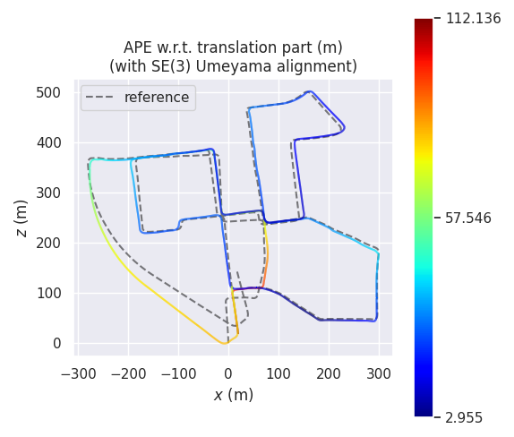
  
</div>

- RPE 

<div style="display: flex; justify-content: center;">
  
  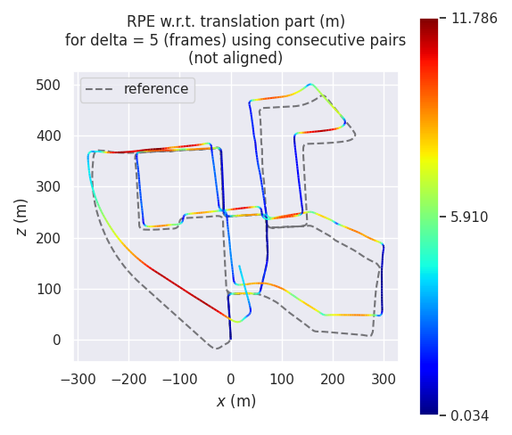
</div>


### 01

- APE 

<div style="display: flex; justify-content: center;">
  
  
  
</div>

- RPE 

<div style="display: flex; justify-content: center;">
  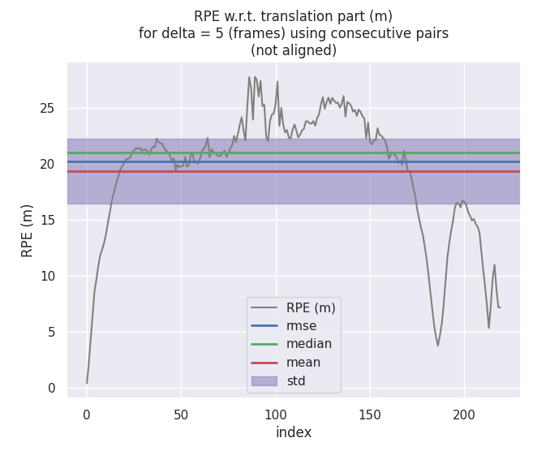
  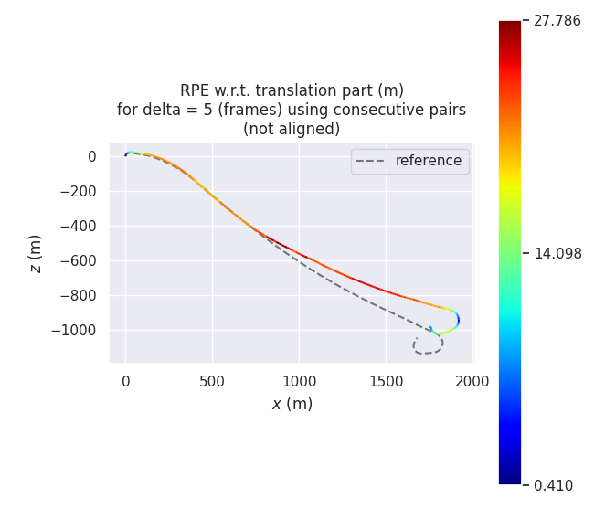
</div>


<p align="center">

### 02

- APE 

<div style="display: flex; justify-content: center;">
  
  
  
</div>

- RPE 

<div style="display: flex; justify-content: center;">
  
  
</div>

### 03

- APE 

<div style="display: flex; justify-content: center;">
  
  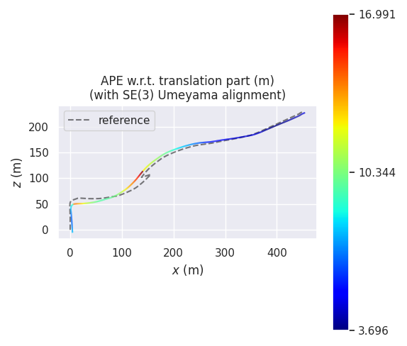
  
</div>

- RPE 

<div style="display: flex; justify-content: center;">
  
  
</div>

### 04

- APE 

- RPE 

### 05

- APE 

<div style="display: flex; justify-content: center;">
  
  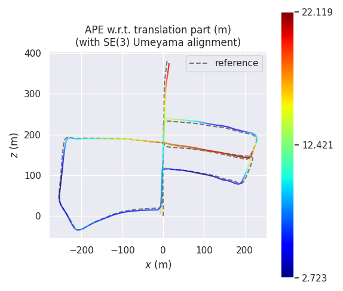
  
</div>

- RPE 

<div style="display: flex; justify-content: center;">
  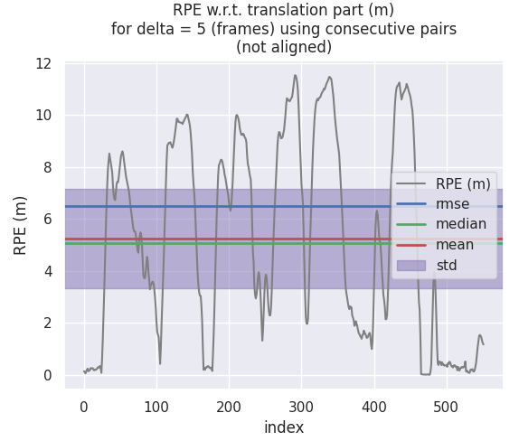
  
</div>

### 06

- APE 

- RPE 

### 07

- APE 

<div style="display: flex; justify-content: center;">
  
  
  
</div>

- RPE 

<div style="display: flex; justify-content: center;">
  
  
</div>

### 08

- APE 

<div style="display: flex; justify-content: center;">
  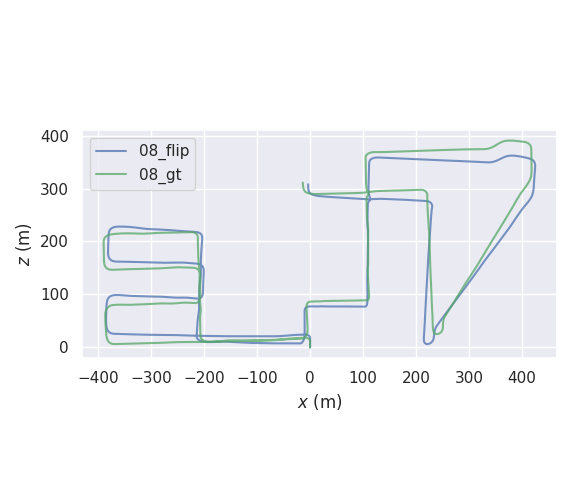
  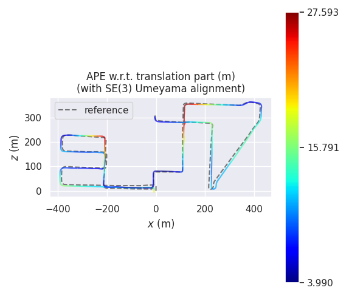
  
</div>

- RPE 

<div style="display: flex; justify-content: center;">
  
  
</div>

### 09

- APE 

<div style="display: flex; justify-content: center;">
  
  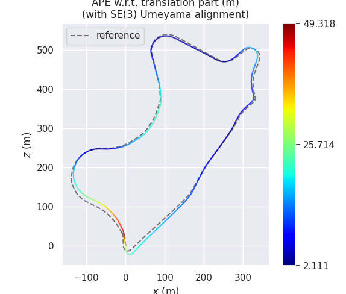
  
</div>

- RPE 

<div style="display: flex; justify-content: center;">
  
  
</div>

### 10

- APE 

<div style="display: flex; justify-content: center;">
  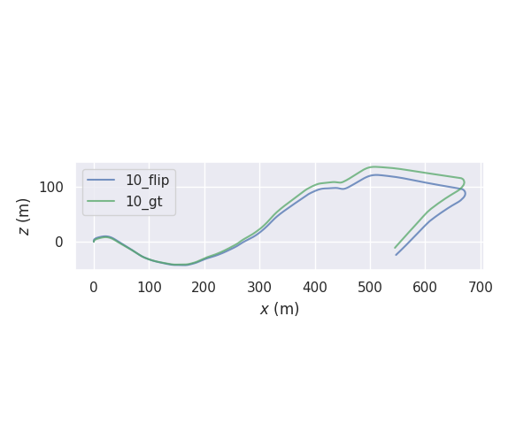
  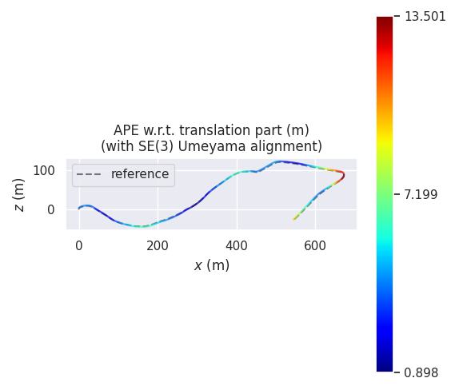
  
</div>

- RPE 

<div style="display: flex; justify-content: center;">
  
  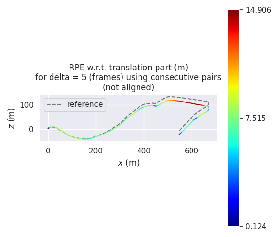
</div>

</p>


